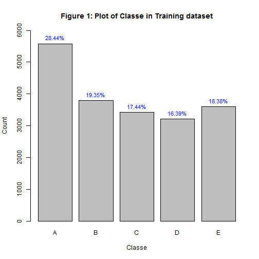
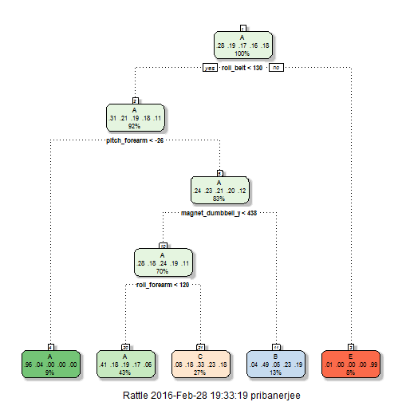
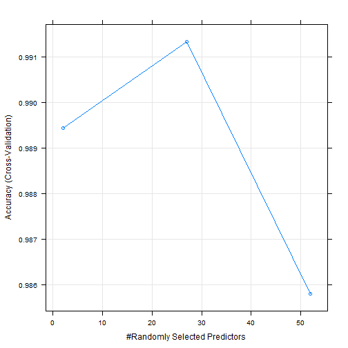

###__Introduction__
This markdown document has been created to document all the steps followed to complete and submit the final project of the __Practical Machine Learning__ course offered by [__John Hopkins University__](https://www.jhu.edu/) via the [Coursera](https://www.coursera.org/) online platform. This document highlights the steps I followed in analysing the data, preprocessing and finally testing a couple of prediction techniques taught in the class to find out the most effective prediction solution.

The project description as provided in the assignment along with sources of data to be used is listed in the following 2 sections. Following them, we shall get into the sections to obtain data, clean-up or preprocessing and model building and testing.

###__Background__

Using devices such as Jawbone Up, Nike FuelBand, and Fitbit it is now possible to collect a large amount of data about personal activity relatively inexpensively. These type of devices are part of the quantified self movement - a group of enthusiasts who take measurements about themselves regularly to improve their health, to find patterns in their behavior, or because they are tech geeks. One thing that people regularly do is quantify how much of a particular activity they do, but they rarely quantify how well they do it. 

In this project, our goal will be to use data from accelerometers on the belt, forearm, arm, and dumbell of 6 participants. They were asked to perform barbell lifts correctly and incorrectly in 5 different ways.

###__Data__

The training data for this project are available here: [Training Data](https://d396qusza40orc.cloudfront.net/predmachlearn/pml-training.csv)

The test data are available here: [Testing Data](https://d396qusza40orc.cloudfront.net/predmachlearn/pml-testing.csv)

The data for this project come from this source: [Groupware@LES - Human Activity Recognition](http://groupware.les.inf.puc-rio.br/har).

###__Load Libraries__

This step will call in the packages from which we shall use multiple fucntions to do the assignment:


```r
library(caret) #We'll mostly use the data partitioning and train functions from Caret
library(rpart) #For decision trees
library(rattle) #For fancy decision tree plots
library(randomForest) #For random forests
```

###__Loading Raw Data__

Let us now write a simple dataload step to load the data. The codes in the lines below will load the data directly from the URL provided: 

```r
trnLnk <- "https://d396qusza40orc.cloudfront.net/predmachlearn/pml-training.csv"
tstLnk <- "https://d396qusza40orc.cloudfront.net/predmachlearn/pml-testing.csv"

training_data <- read.csv(url(trnLnk),na.strings=c("NA","#DIV/0!",""),header=T)
testing_data <- read.csv(url(tstLnk),na.strings=c("NA","#DIV/0!",""),header=T)

#Check dimensions of train dataset
dim(training_data)
```

```
## [1] 19622   160
```

```r
#Check dimensions of test dataset
dim(testing_data)
```

```
## [1]  20 160
```
The training dataset which will be used for fitting our model contains 19,622 observations and 160 variables while the testing data which will be used to validate our model contains 20 observations and 160 variables. The "classe" variable is the response variable which our model will try to predict. With the data loaded into the memory, we'll move into an anlysis of the raw data.

###__Analysis of Raw Data__

Let us also take a look at the distribution of the target variable "Classe" in _Figure 1_ below from the raw training data:


From the above _Figure 1_, the target seems to be a clean variable. Class "A" forms the bulk of numbers while the rest of the classes are almost similar in distribution. With that, let us focus our attention to the predictors.

First, we check the columns and rows to see if there are a sizeable number of complete cases:

```r
sum(complete.cases(training_data))
```

```
## [1] 0
```
The above shows that there are no cases which is complete. That is, each observation has either some NA or incorrect values for certain variables that cannot be used by the prediction algorithms. Hence, we'll now follow data clean-up steps.

###__Data Clean Up__
First, drop the columns which include serial numbers, time-stamps and names:

```r
##Create list of unwanted fields:
trnRemCols <- grepl("^X|timestamp|window|user_name",names(training_data))
tstRemCols <- grepl("^X|timestamp|window|user_name",names(testing_data))

#Remove unwanted fields
trnRmUnwtdCols <- training_data[,!trnRemCols]
tstRmUnwtdCols <- testing_data[,!tstRemCols]
```
Next, find and drop the fields which have "near-zero variance". These won't have a great effect on the prediction algorithm. In the process, we'll also drop columns with NAs and create the cleaned-up training and test datasets:

```r
#Create list of near zero variance fields
NearZeroVar <- nearZeroVar(trnRmUnwtdCols,saveMetrics=T)

#Remove near zero variance fields
trnRmZVCols <- trnRmUnwtdCols[,!NearZeroVar$nzv]
tstRmZVCols <- tstRmUnwtdCols[,!NearZeroVar$nzv]

#Remove fields with NAs
trnNArmCondn <- (colSums(is.na(trnRmZVCols))!=0)
tstNArmCondn <- (colSums(is.na(tstRmZVCols))!=0)

trnRmNACols <- trnRmZVCols[,!trnNArmCondn]
tstRmNACols <- tstRmZVCols[,!tstNArmCondn]

#New Training and Testing Datasets after clean-up
trnDataNew <- trnRmNACols
tstDataNew <- tstRmNACols

dim(trnDataNew); dim(tstDataNew)
```

```
## [1] 19622    53
```

```
## [1] 20 53
```
Post the dataset clean-up, we are left with 53 variables and 19,622 observations in the cleaned up train data and 53 variables and 20 observations in the testing data. With a clean data, we shall now move into sample division step.

###__Prediction Data Design__

First set a seed to enable reproducing results for multiple runs. Then, we'll create a division in the cleaned-up training dataset (_trnDataNew_) to divide it into model training (70%) and model testing (30%) subsets. The cleaned up testing dataset (_tstDataNew_) will be used for model validation.

```r
set.seed(19284601) #For reproducing results

#Train-model Validation Partition
intrain <- createDataPartition(y=trnDataNew$classe,p=0.7,list=F)

modTRNSample <- trnDataNew[intrain,] #To be used for model training
modTSTSample <- trnDataNew[-intrain,] #To be used for testing accuracy of models

dim(modTRNSample); dim(modTSTSample)
```

```
## [1] 13737    53
```

```
## [1] 5885   53
```
Post the division, the model training data contains 70% (of 19,622) or 13,737 observations and 53 variables and the model testing data contains 30% (of 19,622) or 5,885 observations and 53 variables. 

Now, let us get into the model building exercise. We shall first try a decision tree analysis.

###__Model Building and Testing__
We shall now build a predictive model for activity recognition using the __Decision Tree__ approach. We first use the tree approach as it is easiest to interpret and in a non-linear set-up can do better prediction than regression models. As we know, we need to have a good trade-off between accuracy and interpretability. 

So, we'll see how best a predictive algorithm this approach is able to build in the next few lines.

#####__Method 1: Decision Tree__

```r
#Fit a decision tree model
modDTfit <- train(classe~.,method="rpart",data=modTRNSample)
```

_Figure 2_ shows the tree that has been grown out of the step above:



As we see above in _Figure 2_, this approach creates a very easily interpretable classification mechanism. _For example_, in the above, *roll_belt < 130* and *pitch_forearm < -26* combination captures 9% of observations and 96% of those have a classe or activity recognized as "A". We'll now see how this method performs on the model testing subset. We'll mainly look at the confusion matrix and accuracy.


```r
predDTfit = predict(modDTfit, modTSTSample) #Get predictions on model testing subset

#Evaluate Decision Tree Performance on Validation sample
#Calculate Confusion Matrix, Accuracy and Error
confusionMatrix(modTSTSample$classe, predDTfit)
```

```
## Confusion Matrix and Statistics
## 
##           Reference
## Prediction    A    B    C    D    E
##          A 1530   19  123    0    2
##          B  474  375  290    0    0
##          C  485   27  514    0    0
##          D  417  152  395    0    0
##          E  172  138  293    0  479
## 
## Overall Statistics
##                                           
##                Accuracy : 0.4924          
##                  95% CI : (0.4796, 0.5053)
##     No Information Rate : 0.523           
##     P-Value [Acc > NIR] : 1               
##                                           
##                   Kappa : 0.3365          
##  Mcnemar's Test P-Value : NA              
## 
## Statistics by Class:
## 
##                      Class: A Class: B Class: C Class: D Class: E
## Sensitivity            0.4971  0.52743  0.31827       NA  0.99584
## Specificity            0.9487  0.85234  0.88009   0.8362  0.88842
## Pos Pred Value         0.9140  0.32924  0.50097       NA  0.44270
## Neg Pred Value         0.6324  0.92920  0.77341       NA  0.99958
## Prevalence             0.5230  0.12082  0.27443   0.0000  0.08173
## Detection Rate         0.2600  0.06372  0.08734   0.0000  0.08139
## Detection Prevalence   0.2845  0.19354  0.17434   0.1638  0.18386
## Balanced Accuracy      0.7229  0.68988  0.59918       NA  0.94213
```

```r
accuracy_DT <- postResample(predDTfit, modTSTSample$classe)
accuracy_DT
```

```
##  Accuracy     Kappa 
## 0.4924384 0.3364951
```

```r
DTfit_SampleError = 1 - as.numeric(confusionMatrix(modTSTSample$classe, predDTfit)$overall[1])
DTfit_SampleError
```

```
## [1] 0.5075616
```

The above shows a 49% accuracy which is poor and definitely has scope of improvement. Hence we'll try to improve upon it by using a random forest prediction mechanism.

#####__Method 2: Random Forest__

The _Random Forest_ mechanism extends the boosted aggregation technique on the classification/regression trees. This method, although is a bit more complex than the decision tree approach, it is one of the most accurate prediction mechanisms used. It takes care of correlations of predictors and outliers and hence is more robust. To assess different features of the data, we shall use a __5-fold cross validation__.


```r
modRFfit <- train(classe~.,method="rf",data=modTRNSample,trControl=trainControl(method="cv",n=5),tree=250)
modRFfit
```

```
## Random Forest 
## 
## 13737 samples
##    52 predictor
##     5 classes: 'A', 'B', 'C', 'D', 'E' 
## 
## No pre-processing
## Resampling: Cross-Validated (5 fold) 
## Summary of sample sizes: 10991, 10989, 10988, 10989, 10991 
## Resampling results across tuning parameters:
## 
##   mtry  Accuracy   Kappa      Accuracy SD  Kappa SD   
##    2    0.9894439  0.9866448  0.002458686  0.003111167
##   27    0.9913366  0.9890402  0.002053202  0.002596996
##   52    0.9858044  0.9820423  0.002949029  0.003728923
## 
## Accuracy was used to select the optimal model using  the largest value.
## The final value used for the model was mtry = 27.
```

We can represent the random forest variable importance in the following list and diagram in _Figure 3_:


```r
varImp(modRFfit)
```

```
## rf variable importance
## 
##   only 20 most important variables shown (out of 52)
## 
##                      Overall
## roll_belt            100.000
## pitch_forearm         57.326
## yaw_belt              56.035
## pitch_belt            45.886
## magnet_dumbbell_z     45.159
## magnet_dumbbell_y     42.468
## roll_forearm          41.857
## accel_dumbbell_y      21.674
## roll_dumbbell         19.999
## magnet_dumbbell_x     18.643
## accel_forearm_x       17.448
## magnet_belt_z         15.057
## accel_dumbbell_z      14.593
## magnet_forearm_z      14.354
## accel_belt_z          13.834
## magnet_belt_y         13.688
## total_accel_dumbbell  12.906
## gyros_belt_z          11.319
## yaw_arm               10.298
## magnet_belt_x          9.921
```

```r
plot(modRFfit,log="y")
```



So, as usual, now we'll test this algorithm on the model testing dataset and see how accurate a prediction mechanism it is.


```r
predRFfit <- predict(modRFfit, modTSTSample)
#Evaluate Random Forest Performance on Validation sample
#Calculate Confusion Matrix, Accuracy and Error
confusionMatrix(modTSTSample$classe, predRFfit)
```

```
## Confusion Matrix and Statistics
## 
##           Reference
## Prediction    A    B    C    D    E
##          A 1673    1    0    0    0
##          B    6 1131    2    0    0
##          C    0    2 1018    6    0
##          D    0    1   12  951    0
##          E    0    1    5    1 1075
## 
## Overall Statistics
##                                           
##                Accuracy : 0.9937          
##                  95% CI : (0.9913, 0.9956)
##     No Information Rate : 0.2853          
##     P-Value [Acc > NIR] : < 2.2e-16       
##                                           
##                   Kappa : 0.992           
##  Mcnemar's Test P-Value : NA              
## 
## Statistics by Class:
## 
##                      Class: A Class: B Class: C Class: D Class: E
## Sensitivity            0.9964   0.9956   0.9817   0.9927   1.0000
## Specificity            0.9998   0.9983   0.9983   0.9974   0.9985
## Pos Pred Value         0.9994   0.9930   0.9922   0.9865   0.9935
## Neg Pred Value         0.9986   0.9989   0.9961   0.9986   1.0000
## Prevalence             0.2853   0.1930   0.1762   0.1628   0.1827
## Detection Rate         0.2843   0.1922   0.1730   0.1616   0.1827
## Detection Prevalence   0.2845   0.1935   0.1743   0.1638   0.1839
## Balanced Accuracy      0.9981   0.9970   0.9900   0.9950   0.9993
```

```r
accuracy_RF <- postResample(predRFfit, modTSTSample$classe)
accuracy_RF
```

```
##  Accuracy     Kappa 
## 0.9937128 0.9920467
```

```r
RFfit_SampleError = 1 - as.numeric(confusionMatrix(modTSTSample$classe, predRFfit)$overall[1])
RFfit_SampleError
```

```
## [1] 0.006287171
```

The random forest algorithm _**modRFfit**_ shows a great accuracy of > 99%. The confusion matrix shows an excellent fit and shows very less misclassified values. We hence, have reasons to believe that it is a good algorithm and can take it forward to test on the validation data (_tstDataNew_). The data to be used for validation has been cleaned up already before.

```r
#Prediction on RF on Test Data (tstDataNew) for model validation
PRED_RF_TST_DATA <- predict(modRFfit,newdata=tstDataNew)

PRED_RF_TST_DATA
```

```
##  [1] B A B A A E D B A A B C B A E E A B B B
## Levels: A B C D E
```

The above results give 100% correct results in the Final Prediction Assignment Test. So, this Random Forest algorithm - _**modRFfit**_ also passes the validation test and a great algorithm to use in this case.

###__Conclusion__
To conclude, the basic idea of any machine learning algorithm to be of use is a combination of accuracy and scalability. For the purposes of our project - the classification tree approach, though was very easy to interpret and implement, was slightly less accurate in performance. But the random forest, though a little more complex, was easily scalable and way more accurate. Hence, the random forest technique was chosen as the final prediction algorithm.


